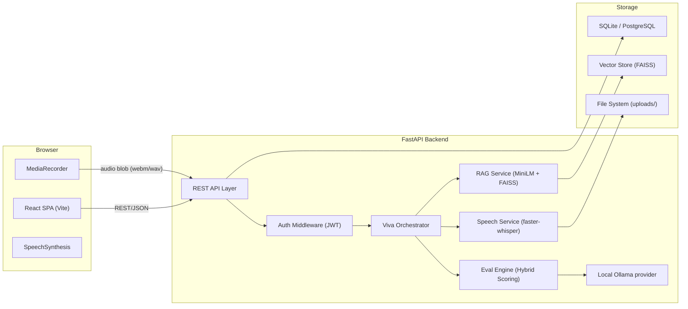

# AI-Based Viva Voce System

Automated oral examination platform powered by Speech-to-Text (faster-whisper), Retrieval-Augmented Generation (RAG), and Large Language Model (LLM) scoring.

---

## 🚀 Overview

The **AI-Based Viva Voce System** conducts interactive oral examinations for university students:
1. **RAG Question Generation**: Ingests syllabus notes and documents to generate contextual exam-grade questions with expected key criteria.
2. **Speech Evaluation**: Captures spoken answers from the student's browser and performs local transcription via `faster-whisper`.
3. **Hybrid Scoring Engine**: Blends embedding semantic similarity with rubric-based LLM evaluation for objective, hallucination-resistant scoring.
4. **Teacher Oversight**: Full audit trails with teacher score overrides and feedback reporting.

---

## 🏛️ Architecture Overview



---

## 📋 Monorepo Structure

```
.
├── backend/
│   ├── alembic/                # Database migrations
│   ├── app/
│   │   ├── main.py             # FastAPI app & routes
│   │   ├── config.py           # Pydantic Settings & environment config
│   │   ├── database.py         # Async SQLAlchemy engine & sessionmaker
│   │   ├── models/             # SQLAlchemy ORM models
│   │   ├── schemas/            # Pydantic request/response schemas
│   │   ├── api/                # Route handlers
│   │   ├── services/           # Business logic & services
│   │   └── utils/              # Text cleanup & helpers
│   ├── tests/                  # Pytest test suite
│   ├── uploads/                # Runtime file storage (gitignored)
│   ├── vector_store/           # FAISS vector storage (gitignored)
│   └── pyproject.toml          # Python dependencies & tool configs
├── frontend/
│   ├── src/
│   │   ├── api/client.js       # Axios HTTP client
│   │   ├── App.jsx             # React root view
│   │   └── main.jsx            # Vite entrypoint
│   └── package.json            # Node dependencies
├── .github/workflows/
│   └── ci.yml                  # GitHub Actions CI workflow
├── .pre-commit-config.yaml     # Git pre-commit hooks
├── dev.py                      # One-command development runner
├── Makefile                    # Make targets
├── .env.example                # Sample environment configuration
└── README.md
```

---

## ⚡ Quickstart

### Prerequisites
- **Python 3.11+**
- **Node.js 18+** & **npm**
- **Ollama** with the local `llama3.2:3b` model (free local inference)
- A working webcam and microphone for the live interview

### Local AI setup
The backend uses Ollama locally for question generation, answer scoring, and adaptive follow-ups. It uses faster-whisper locally for transcription. No paid AI API key is required. Install Ollama, then run:

```bash
ollama pull llama3.2:3b
```

Copy `.env.example` to `.env` if you do not have a local `.env` yet. Set a private random `SECRET_KEY`; the checked-out development `.env` is ignored by Git. The backend reads the project-root `.env` when started from the documented runner. Run `alembic upgrade head` from `backend/` after updating an existing database to add camera analysis consent.

### Option 1: One-Command Runner
To start both the backend and frontend simultaneously:

```bash
# Setup backend virtual environment & dependencies
cd backend
python -m venv .venv
# On Windows:
.venv\Scripts\pip install -e ".[dev]"
# On Linux/macOS:
source .venv/bin/activate && pip install -e ".[dev]"
cd ..

# Install frontend dependencies
cd frontend
npm install
cd ..

# Run both servers concurrently
python dev.py
```
- Frontend will be available at: **http://localhost:5173**
- Backend API will be available at: **http://127.0.0.1:8000**
- Interactive Swagger docs: **http://127.0.0.1:8000/docs**

---

### Option 2: Running Services Separately

#### Backend Server
```bash
cd backend
.venv\Scripts\activate          # Windows
# or: source .venv/bin/activate  # Linux/macOS

uvicorn app.main:app --reload --host 127.0.0.1 --port 8000
```

#### Frontend Development Server
```bash
cd frontend
npm run dev
```

---

## 🧪 Testing & Code Quality

### Run Pytest Suite
```bash
cd backend
pytest
```

### Linting & Formatting (Ruff)
```bash
cd backend
ruff check app tests
ruff format --check app tests
```

### Database Migrations (Alembic)
```bash
cd backend
alembic upgrade head
```

---

## 🗺️ Roadmap & Phase Progress
- [x] **Phase 0: Setup & Foundations** (Monorepo, FastAPI, SQLite, React/Vite, CI, Health endpoint)
- [ ] **Phase 1: Back-End Core & Data Model** (Auth, Roles, Courses/Topics CRUD)
- [ ] **Phase 2: Content Ingestion & RAG Question Generation**
- [ ] **Phase 3: Speech Pipeline (faster-whisper)**
- [ ] **Phase 4: Evaluation & Scoring Engine**
- [ ] **Phase 5: Viva Session Orchestrator**
- [ ] **Phase 6: Front-End UI/UX**
- [ ] **Phase 7: Evaluation, Experiments & Hardening**
