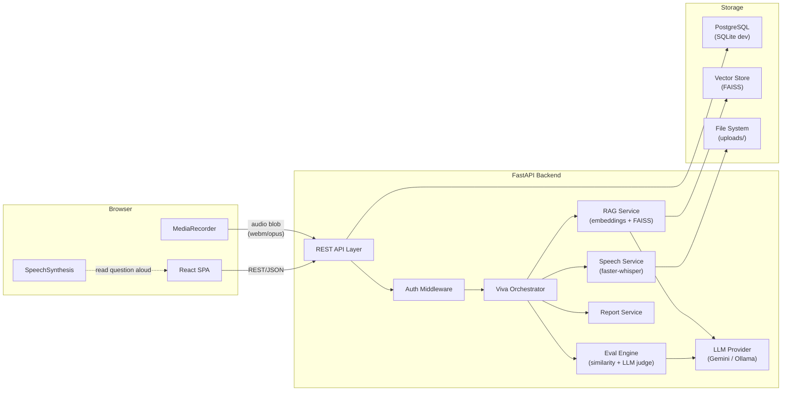
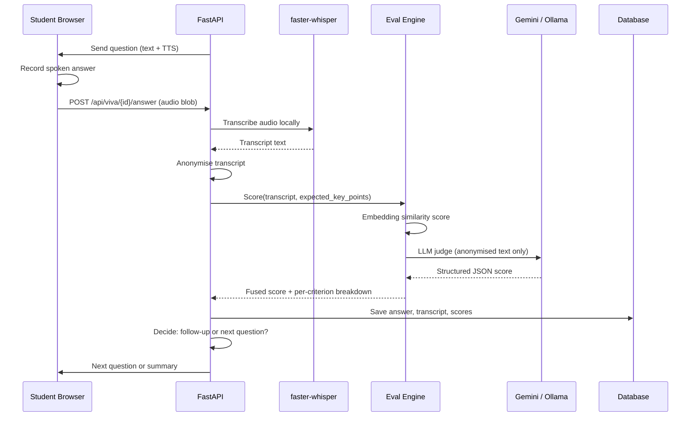
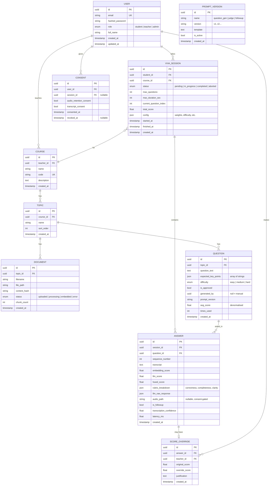

# AI-Based Viva Voce System — Development Plan

> **Solo developer · 12 weeks · Free resources only · Laptop demo**

---

## Assumptions (filling in the `[X]` placeholders)

| Placeholder | Assumed value | Impact |
|---|---|---|
| Hours/week | **15 h/week** (180 h total) | Task estimates assume this; scale linearly if you have more/less |
| Deadline | **~Dec 12 2026** (12 weeks from ~Sep 19) | Weeks numbered W1–W12 below |
| RAM | **8 GB** | Drives model-size choices (whisper-base, 7B quantized LLM) |
| GPU | **No dedicated GPU** | All inference on CPU; dictates latency expectations |
| OS | **Windows 11** | Dev tooling notes; WSL2 optional for faster-whisper |

> [!IMPORTANT]
> Replace the assumed values above with your real specs. If you have 16 GB RAM or a GPU, I'll note upgrade paths in each phase.

---

## 1. Monorepo Folder Structure

```
viva-voce/
├── .github/
│   ├── workflows/
│   │   └── ci.yml                  # GitHub Actions: lint + test
│   └── copilot-instructions.md     # Copilot context (content at end of doc)
├── backend/
│   ├── alembic/                    # DB migrations
│   │   ├── versions/
│   │   └── env.py
│   ├── alembic.ini
│   ├── app/
│   │   ├── __init__.py
│   │   ├── main.py                 # FastAPI app factory
│   │   ├── config.py               # Pydantic Settings, .env loading
│   │   ├── database.py             # Engine, SessionLocal, Base
│   │   ├── models/                 # SQLAlchemy ORM models
│   │   │   ├── __init__.py
│   │   │   ├── user.py
│   │   │   ├── course.py
│   │   │   ├── topic.py
│   │   │   ├── document.py
│   │   │   ├── question.py
│   │   │   ├── viva_session.py
│   │   │   ├── answer.py
│   │   │   └── consent.py
│   │   ├── schemas/                # Pydantic request/response schemas
│   │   │   ├── __init__.py
│   │   │   ├── user.py
│   │   │   ├── course.py
│   │   │   ├── question.py
│   │   │   ├── viva.py
│   │   │   └── report.py
│   │   ├── api/                    # Route modules (one per resource)
│   │   │   ├── __init__.py
│   │   │   ├── deps.py             # Dependency injection (get_db, get_current_user)
│   │   │   ├── auth.py
│   │   │   ├── courses.py
│   │   │   ├── topics.py
│   │   │   ├── documents.py
│   │   │   ├── questions.py
│   │   │   ├── viva.py
│   │   │   ├── answers.py
│   │   │   └── reports.py
│   │   ├── services/               # Business logic
│   │   │   ├── __init__.py
│   │   │   ├── auth_service.py
│   │   │   ├── document_service.py
│   │   │   ├── rag_service.py      # Chunking, embedding, retrieval
│   │   │   ├── question_service.py # Generation, caching, bank
│   │   │   ├── speech_service.py   # faster-whisper wrapper
│   │   │   ├── eval_service.py     # Scoring engine
│   │   │   ├── llm_service.py      # Provider abstraction
│   │   │   ├── viva_orchestrator.py# Session state machine
│   │   │   └── report_service.py
│   │   ├── llm/                    # LLM provider interface
│   │   │   ├── __init__.py
│   │   │   ├── base.py             # Abstract LLMProvider
│   │   │   ├── gemini.py           # Google Gemini free tier
│   │   │   ├── ollama.py           # Local Ollama fallback
│   │   │   └── prompts/            # Versioned prompt templates
│   │   │       ├── question_gen_v1.txt
│   │   │       ├── judge_v1.txt
│   │   │       └── followup_v1.txt
│   │   └── utils/
│   │       ├── __init__.py
│   │       ├── text.py             # Transcript cleanup, anonymisation
│   │       └── retry.py            # Exponential backoff helper
│   ├── tests/
│   │   ├── conftest.py
│   │   ├── test_auth.py
│   │   ├── test_rag.py
│   │   ├── test_speech.py
│   │   ├── test_eval.py
│   │   ├── test_viva.py
│   │   └── fixtures/               # Sample audio, PDFs, golden answers
│   ├── uploads/                    # Gitignored; runtime file storage
│   ├── vector_store/               # Gitignored; FAISS/Chroma data
│   ├── pyproject.toml              # Dependencies, ruff, pytest config
│   └── Dockerfile                  # Optional, for reproducibility
├── frontend/
│   ├── public/
│   ├── src/
│   │   ├── main.jsx
│   │   ├── App.jsx
│   │   ├── api/                    # Axios/fetch wrappers
│   │   │   └── client.js
│   │   ├── hooks/                  # Custom React hooks
│   │   │   ├── useAuth.js
│   │   │   ├── useRecorder.js      # MediaRecorder wrapper
│   │   │   └── useViva.js          # Session state hook
│   │   ├── pages/
│   │   │   ├── Login.jsx
│   │   │   ├── StudentDashboard.jsx
│   │   │   ├── VivaScreen.jsx      # Main viva experience
│   │   │   ├── FeedbackReport.jsx
│   │   │   ├── TeacherDashboard.jsx
│   │   │   ├── QuestionBank.jsx
│   │   │   └── SessionReview.jsx
│   │   ├── components/
│   │   │   ├── MicButton.jsx
│   │   │   ├── TranscriptDisplay.jsx
│   │   │   ├── Timer.jsx
│   │   │   ├── ScoreCard.jsx
│   │   │   ├── ConsentModal.jsx
│   │   │   └── Navbar.jsx
│   │   └── utils/
│   │       └── audio.js            # Blob handling, format conversion
│   ├── package.json
│   ├── vite.config.js
│   └── .env.example
├── evaluation/                     # Phase 7 experiment scripts
│   ├── datasets/                   # Gold-standard Q/A pairs
│   ├── scripts/
│   │   ├── compute_wer.py
│   │   ├── compute_correlation.py
│   │   └── run_experiment.py
│   └── results/
├── docs/
│   ├── architecture.md
│   ├── api.md
│   ├── privacy.md
│   └── demo-script.md
├── .env.example
├── .pre-commit-config.yaml
├── docker-compose.yml              # Optional: Postgres + app
├── Makefile                        # Convenience targets
└── README.md
```

---

## 2. High-Level Architecture

### Component Diagram



### Data Flow — One Viva Turn



### REST API Endpoints

| # | Method | Endpoint | Purpose |
|---|---|---|---|
| **Auth** ||||
| 1 | POST | `/api/auth/register` | Register new user (student/teacher) |
| 2 | POST | `/api/auth/login` | Login, return JWT token |
| 3 | GET | `/api/auth/me` | Get current user profile |
| **Courses** ||||
| 4 | POST | `/api/courses` | Create a course (teacher) |
| 5 | GET | `/api/courses` | List courses for current user |
| 6 | GET | `/api/courses/{id}` | Get course details |
| 7 | PUT | `/api/courses/{id}` | Update course |
| 8 | DELETE | `/api/courses/{id}` | Delete course |
| **Topics** ||||
| 9 | POST | `/api/courses/{cid}/topics` | Add topic to course |
| 10 | GET | `/api/courses/{cid}/topics` | List topics |
| 11 | PUT | `/api/topics/{id}` | Update topic |
| 12 | DELETE | `/api/topics/{id}` | Delete topic |
| **Documents** ||||
| 13 | POST | `/api/topics/{tid}/documents` | Upload syllabus/notes (PDF/txt) |
| 14 | GET | `/api/topics/{tid}/documents` | List uploaded documents |
| 15 | DELETE | `/api/documents/{id}` | Delete document and its embeddings |
| 16 | POST | `/api/documents/{id}/embed` | Trigger chunking + embedding |
| **Questions** ||||
| 17 | POST | `/api/topics/{tid}/questions/generate` | Generate questions via RAG + LLM |
| 18 | GET | `/api/topics/{tid}/questions` | List question bank for topic |
| 19 | GET | `/api/questions/{id}` | Get single question with key points |
| 20 | PUT | `/api/questions/{id}` | Teacher edits question/key points |
| 21 | DELETE | `/api/questions/{id}` | Delete question |
| 22 | POST | `/api/questions/{id}/approve` | Teacher approves generated question |
| **Viva Sessions** ||||
| 23 | POST | `/api/viva/sessions` | Start a new viva session |
| 24 | GET | `/api/viva/sessions` | List sessions (filtered by role) |
| 25 | GET | `/api/viva/sessions/{id}` | Get session details |
| 26 | POST | `/api/viva/sessions/{id}/next` | Get next question for session |
| 27 | POST | `/api/viva/sessions/{id}/answer` | Submit audio answer |
| 28 | POST | `/api/viva/sessions/{id}/finish` | End session, trigger final scoring |
| 29 | GET | `/api/viva/sessions/{id}/transcript` | Get full transcript |
| **Scoring & Reports** ||||
| 30 | GET | `/api/viva/sessions/{id}/report` | Get feedback report |
| 31 | PUT | `/api/viva/sessions/{id}/scores/{aid}` | Teacher overrides a score |
| 32 | GET | `/api/reports/export?session_id=X` | Export session as CSV |
| **Consent & Privacy** ||||
| 33 | POST | `/api/consent` | Record consent decision |
| 34 | DELETE | `/api/users/{id}/audio` | Delete all audio for a user |
| **Health** ||||
| 35 | GET | `/api/health` | Liveness check (DB, whisper, LLM) |

---

## 3. Draft Database Schema



### Key Design Decisions

| Decision | Rationale |
|---|---|
| UUIDs over auto-increment | Safer for API exposure; no enumeration attacks |
| `expected_key_points` as JSON array | Flexible length; avoids a join-heavy normalised table for something rarely queried independently |
| `rubric_breakdown` as JSON | Schema evolves (add criteria) without migrations |
| Separate `SCORE_OVERRIDE` table | Preserves audit trail; original score never mutated |
| `PROMPT_VERSION` table | Enables A/B testing prompts and reproducibility |
| `audio_path` nullable | Only populated if consent granted; deletion sets to null |

---

## 4. Top 10 Risks

| # | Risk | Likelihood | Impact | Mitigation |
|---|---|---|---|---|
| 1 | **Gemini free-tier rate limits hit mid-viva** | High | High | Pre-generate question bank offline. Cache LLM judge responses. Design for ≤1 LLM call per answer. Implement exponential backoff with jitter (3 retries). Fall back to Ollama local model. Queue non-urgent scoring for batch processing. |
| 2 | **ASR errors on Indian-accented English & technical terms** | High | High | Use `faster-whisper` `small` model (better accuracy, ~1 GB RAM). Add a domain glossary via `initial_prompt` parameter. Allow students to type corrections for key terms. Show transcript for student confirmation before scoring. Log WER on pilot data and switch model size if needed. |
| 3 | **LLM hallucination / scoring bias** | Medium | High | Constrain output with strict JSON schema + Pydantic validation. Provide expected key points in prompt (RAG-grounded). Hybrid scoring (embedding similarity is hallucination-free; LLM is one signal, not the only one). Teacher override always available. Log raw LLM responses for audit. |
| 4 | **Latency: transcription + LLM scoring too slow for interactive viva** | High | Medium | Target budget: transcription <10s, scoring <8s per turn. Use whisper-base (faster) during live viva, whisper-small for offline re-scoring. Stream transcription progress to UI. Show "thinking..." animation. Pipeline: start scoring while student reads next question. |
| 5 | **Privacy: accidental PII in LLM prompts** | Medium | High | Anonymise transcripts before LLM call (strip names, roll numbers via regex + NER). Never send audio to external APIs. Consent gate before recording. Implement `DELETE /users/{id}/audio` to honour deletion. Document data flow in privacy.md. |
| 6 | **8 GB RAM exhaustion running whisper + embeddings + Ollama simultaneously** | High | High | Never load all models at once. Load whisper on-demand and unload after transcription. Sentence-transformers is small (~80 MB). For Ollama fallback, use 4-bit quantised 7B model (~4 GB). Add memory guard that refuses to start viva if free RAM < 2 GB. |
| 7 | **Scope creep: 12 weeks is tight for a solo dev** | High | Medium | Strict MVP definition (see §13). Each phase has "cut if behind" items. Phase 7 (experiments) scoped to 5 pilot sessions minimum. Phase 6 (frontend) uses a component library (Shadcn/UI or Chakra) to avoid CSS bikeshedding. |
| 8 | **Gemini free tier terms change or become unavailable** | Medium | Medium | Provider abstraction layer (`LLMProvider` interface). Ollama fallback always functional. Test both paths in CI. Pin `google-genai` SDK version. |
| 9 | **Demo day: mic fails, API down, or model crashes** | Medium | High | Pre-record a demo video as backup. Seed the DB with a completed session (transcript + scores). Build a "replay mode" that walks through a pre-recorded session. Test on the exact demo laptop 48h before. Bring a USB mic as backup. |
| 10 | **Question quality: RAG retrieves irrelevant chunks → bad questions** | Medium | Medium | Chunk with overlap (512 tokens, 64 overlap). Retrieve top-5 chunks, let LLM select relevant ones. Teacher approval gate before questions enter the bank. Track `avg_score` per question; auto-flag low-performing questions. |

---

## 5. Testing Strategy

### 5.1 Unit Tests (run on every commit via CI)

| Layer | What to test | Tools |
|---|---|---|
| Models | Schema creation, constraints, relationships | pytest + SQLAlchemy in-memory SQLite |
| Schemas | Pydantic validation (valid + invalid payloads) | pytest |
| Services | Business logic with mocked dependencies | pytest + `unittest.mock` |
| LLM Provider | JSON schema validation on mock responses | pytest |
| Eval Engine | Score fusion math (weighted average, edge cases: 0, 1, NaN) | pytest |
| Text Utils | Anonymisation regex, transcript cleanup | pytest |
| RAG | Chunking output shapes, embedding dimensions | pytest |

**Target: ~80% coverage on `services/` and `llm/`.**

### 5.2 Integration Tests (run in CI, slower suite)

| Scope | What to test | Setup |
|---|---|---|
| API endpoints | Full request→DB→response cycle | pytest + `httpx.AsyncClient` + TestClient + SQLite |
| Auth flow | Register → login → access protected route → forbidden for wrong role | JWT with test secret |
| Document upload | Upload PDF → chunks created → embeddings stored | Test fixture PDF |
| Viva flow | Start session → submit mock audio → get score → finish | Mock `speech_service` to return known transcript |
| LLM integration | Real call to Gemini (skip in CI by default, run manually) | `@pytest.mark.integration` marker |

### 5.3 Evaluation Dataset for Scoring Quality (Phase 7)

```
evaluation/
├── datasets/
│   ├── gold_standard.json       # 30-50 Q/A pairs with human reference scores
│   └── domain_glossary.txt      # Technical terms for WER adjustment
├── scripts/
│   ├── compute_wer.py           # Word Error Rate vs. manual transcripts
│   ├── compute_correlation.py   # Pearson, Spearman, QWK vs. human scores
│   └── run_experiment.py        # Sweep: model sizes × prompt versions × weights
└── results/
    └── experiment_log.csv
```

**Gold standard creation process:**
1. Record 5 volunteers answering 6–10 questions each (30–50 pairs).
2. Manually transcribe a subset (10–15) for WER.
3. Have a faculty member or senior score each answer 1–10 on correctness, completeness, clarity.
4. Run the system scorer on the same answers.
5. Compute inter-rater metrics.

**Metrics & thresholds (aspirational for a minor project):**

| Metric | Target | "Acceptable" |
|---|---|---|
| WER (technical speech) | < 25% | < 35% |
| Pearson r (system vs human) | > 0.70 | > 0.55 |
| Spearman ρ | > 0.65 | > 0.50 |
| QWK (binned to 5 levels) | > 0.60 | > 0.45 |
| Per-turn latency | < 15s | < 25s |
| Usability (SUS score) | > 68 | > 55 |

---

## 6. Phases — Detailed Breakdown

---

### Phase 0: Setup & Foundations (Week 1)

**Goal:** A working monorepo with CI, linting, and a "hello" flow from React → FastAPI → DB.

**Definition of Done:**
- [x] `git clone` → one command → backend + frontend running.
- [x] CI pipeline green: linting + 1 passing test.
- [x] `GET /api/health` returns `{ "status": "ok", "db": "connected" }`.
- [x] React page shows "Hello, Viva!" fetched from the API.

**Task Checklist:**

| # | Task | Est. (h) |
|---|---|---|
| 0.1 | Init git repo, `.gitignore`, `README.md` skeleton | 0.5 |
| 0.2 | Backend: `pyproject.toml` with FastAPI, uvicorn, SQLAlchemy, alembic, pydantic-settings, ruff, pytest | 1.0 |
| 0.3 | Configure ruff (linting + formatting), mypy basic config | 0.5 |
| 0.4 | `.env.example`, `config.py` with Pydantic Settings | 1.0 |
| 0.5 | `database.py`: engine, session factory, Base. SQLite for dev. | 1.0 |
| 0.6 | `main.py`: FastAPI app with CORS, `/api/health` endpoint | 1.0 |
| 0.7 | Alembic init, first migration (empty, just proves it works) | 1.0 |
| 0.8 | `tests/conftest.py`, first test for health endpoint | 1.0 |
| 0.9 | Frontend: `npm create vite@latest` with React + JS, install axios | 1.0 |
| 0.10 | Proxy config in `vite.config.js` to backend | 0.5 |
| 0.11 | `App.jsx` calls `/api/health`, displays result | 1.0 |
| 0.12 | `.pre-commit-config.yaml` (ruff, trailing whitespace, YAML check) | 0.5 |
| 0.13 | `.github/workflows/ci.yml`: checkout → install → lint → test | 1.5 |
| 0.14 | `Makefile` with targets: `dev`, `test`, `lint`, `migrate` | 0.5 |
| 0.15 | Write README: project description, setup instructions, architecture overview | 1.0 |
| | **Total** | **~12 h** |

**Files & Modules Created:**
- `backend/pyproject.toml`, `backend/app/main.py`, `backend/app/config.py`, `backend/app/database.py`
- `backend/alembic/`, `backend/alembic.ini`
- `backend/tests/conftest.py`, `backend/tests/test_health.py`
- `frontend/` (Vite scaffold), `frontend/src/App.jsx`, `frontend/src/api/client.js`
- `.pre-commit-config.yaml`, `.github/workflows/ci.yml`, `Makefile`, `.env.example`, `README.md`

**Dependencies on Earlier Phases:** None (this is the first phase).

**What to Test:**
- Health endpoint returns 200 with JSON body.
- Ruff reports zero lint errors.
- CI pipeline passes.

**Demo:** Open browser → React page says "Hello, Viva! Backend status: ok, DB: connected."

**MVP vs Stretch:**
- **MVP:** Everything above.
- **Cut if behind:** Skip pre-commit hooks (run ruff manually), skip Makefile (use raw commands).

**Copilot Prompt:**
```
You are helping me build an "AI-Based Viva Voce System" — a web app for
automated oral examination. Tech stack: FastAPI (Python 3.11+), React (Vite),
SQLAlchemy with SQLite (dev) / PostgreSQL (prod), Alembic migrations.

TASK: Set up Phase 0 — project foundations.

1. Create backend/app/config.py using pydantic-settings to load DATABASE_URL,
   SECRET_KEY, DEBUG from .env.
2. Create backend/app/database.py with async SQLAlchemy engine, sessionmaker,
   and Base.
3. Create backend/app/main.py with a FastAPI app that has CORS middleware and
   a GET /api/health endpoint returning {"status": "ok", "db": "connected"}
   (actually ping the DB).
4. Initialise Alembic in backend/alembic/ pointing at app.database.Base.
5. Create backend/tests/conftest.py with a test client fixture using an
   in-memory SQLite database.
6. Create backend/tests/test_health.py with a test that GETs /api/health and
   asserts 200.

Use Python type hints everywhere. Use UUID for all primary keys. Follow PEP 8
and use ruff-compatible style. Add docstrings to all public functions.
```

---

### Phase 1: Back-End Core & Data Model (Weeks 2–3)

**Goal:** Auth, roles, full DB schema, and CRUD for courses/topics/viva-sessions.

**Definition of Done:**
- [ ] A teacher can register, login, create a course, add topics.
- [ ] A student can register, login, see assigned courses.
- [ ] JWT auth protects all endpoints; role-based access works.
- [ ] Alembic migration creates all tables from the schema above.
- [ ] Consent endpoint records and retrieves consent status.
- [ ] 15+ passing tests covering auth and CRUD.

**Task Checklist:**

| # | Task | Est. (h) |
|---|---|---|
| 1.1 | `models/user.py`: User ORM model (id, email, hashed_password, role, full_name, timestamps) | 1.5 |
| 1.2 | `services/auth_service.py`: hash password (bcrypt), verify, create JWT, decode JWT | 2.0 |
| 1.3 | `schemas/user.py`: UserCreate, UserLogin, UserResponse, TokenResponse | 1.0 |
| 1.4 | `api/auth.py`: POST /register, POST /login, GET /me | 2.0 |
| 1.5 | `api/deps.py`: `get_db`, `get_current_user`, `require_role("teacher")` dependency | 1.5 |
| 1.6 | `models/course.py`, `models/topic.py`: ORM models | 1.0 |
| 1.7 | `schemas/course.py`: CourseCreate, CourseResponse, TopicCreate, TopicResponse | 1.0 |
| 1.8 | `api/courses.py`: CRUD endpoints for courses (teacher-only create/update/delete) | 2.0 |
| 1.9 | `api/topics.py`: CRUD endpoints for topics | 1.5 |
| 1.10 | `models/viva_session.py`, `models/answer.py`, `models/score_override.py` | 2.0 |
| 1.11 | `models/consent.py`: Consent ORM model | 0.5 |
| 1.12 | `api/` stubs for viva and consent endpoints (return 501 Not Implemented) | 1.0 |
| 1.13 | `models/document.py`, `models/question.py`, `models/prompt_version.py` | 1.5 |
| 1.14 | Generate Alembic migration for all models, test up/down | 1.5 |
| 1.15 | `api/consent.py`: POST consent, GET consent status | 1.0 |
| 1.16 | Tests: auth flow (register, login, protected route, wrong role → 403) | 2.0 |
| 1.17 | Tests: course CRUD, topic CRUD | 2.0 |
| 1.18 | Seed script: create a test teacher + student + course + topics | 1.0 |
| | **Total** | **~23 h** |

**Files & Modules Created:**
- All files under `backend/app/models/`
- `backend/app/schemas/user.py`, `backend/app/schemas/course.py`
- `backend/app/api/auth.py`, `backend/app/api/courses.py`, `backend/app/api/topics.py`, `backend/app/api/consent.py`, `backend/app/api/deps.py`
- `backend/app/services/auth_service.py`
- `backend/alembic/versions/001_initial_schema.py`
- `backend/tests/test_auth.py`, `backend/tests/test_courses.py`

**Dependencies:** Phase 0 (repo structure, database, testing harness).

**What to Test:**
- Register → login → JWT valid → access `/me`.
- Wrong password → 401. Student accessing teacher endpoint → 403.
- CRUD lifecycle: create course → list → update → delete.
- Consent: grant → verify → revoke.

**Demo:** Use Swagger UI (`/docs`): register a teacher, login, create a course with topics, register a student, show role-based access control.

**MVP vs Stretch:**
- **MVP:** User, Course, Topic, Consent. JWT auth. Basic CRUD.
- **Cut if behind:** Skip admin role (teacher + student only). Skip consent revocation (only creation). Stub viva/answer/question models with just `id` and `created_at`.

**Copilot Prompt:**
```
Context: AI Viva Voce System. FastAPI + SQLAlchemy + Alembic. Phase 0 is done:
health endpoint, database.py, config.py all working.

TASK: Implement Phase 1 — Auth and Data Model.

1. Create backend/app/models/user.py with UUID PK, email (unique), hashed_password,
   role (Enum: student, teacher, admin), full_name, created_at, updated_at.
2. Create backend/app/services/auth_service.py:
   - hash_password(plain) → str using bcrypt
   - verify_password(plain, hashed) → bool
   - create_access_token(user_id, role) → str (JWT, HS256, 24h expiry)
   - decode_access_token(token) → dict
3. Create backend/app/api/deps.py with:
   - get_db() async generator
   - get_current_user(token: str = Depends(oauth2_scheme)) → User
   - require_role(*roles) → dependency that raises 403
4. Create POST /api/auth/register, POST /api/auth/login, GET /api/auth/me.
5. Create Course and Topic models with relationships.
6. Create CRUD endpoints for courses and topics, teacher-only for mutations.
7. Generate Alembic migration.

Use Pydantic v2 schemas. All IDs are UUIDs. Return 201 on create, 204 on delete.
Handle duplicate email with 409. Add docstrings.
```

---

### Phase 2: Content Ingestion & RAG Question Generation (Weeks 3–4)

**Goal:** Teachers upload syllabus PDFs, system chunks and embeds them, generates questions with key points, and caches them in a question bank.

**Definition of Done:**
- [ ] Upload a PDF → chunks appear in the vector store.
- [ ] `POST /generate` creates 5 questions with key points and difficulty levels.
- [ ] Questions are cached in the DB; re-generation doesn't duplicate.
- [ ] Teacher can review, edit, and approve questions via API.
- [ ] Retrieval: given a topic, relevant chunks are returned (top-5).

**Task Checklist:**

| # | Task | Est. (h) |
|---|---|---|
| 2.1 | Install dependencies: `PyMuPDF` (fitz) for PDF, `sentence-transformers`, `faiss-cpu` | 1.0 |
| 2.2 | `services/document_service.py`: upload file, extract text from PDF/TXT, save to `uploads/` | 2.0 |
| 2.3 | `services/rag_service.py` — chunking: split text into 512-token chunks with 64-token overlap using a simple recursive splitter | 2.5 |
| 2.4 | `services/rag_service.py` — embedding: load `all-MiniLM-L6-v2`, embed chunks, store in FAISS index per topic | 3.0 |
| 2.5 | `services/rag_service.py` — retrieval: given a query, return top-k chunks with scores | 1.5 |
| 2.6 | `services/question_service.py`: generate questions using LLM + retrieved chunks | 3.0 |
| 2.7 | Design question generation prompt (v1): input = chunks + topic name, output = JSON array of `{question, key_points, difficulty}` | 2.0 |
| 2.8 | `llm/base.py`: abstract `LLMProvider` with `generate(prompt, schema) → dict` | 1.0 |
| 2.9 | `llm/gemini.py`: implement using `google-genai` SDK, structured output with JSON schema | 2.5 |
| 2.10 | `utils/retry.py`: exponential backoff with jitter (3 retries, 429/500 handling) | 1.5 |
| 2.11 | `api/documents.py`: POST upload, GET list, DELETE, POST embed | 2.0 |
| 2.12 | `api/questions.py`: POST generate, GET list, GET single, PUT edit, POST approve, DELETE | 2.5 |
| 2.13 | `schemas/question.py`: QuestionGenerate, QuestionResponse, QuestionUpdate | 1.0 |
| 2.14 | Save `PROMPT_VERSION` to DB on first use | 0.5 |
| 2.15 | Tests: chunking (correct count, overlap), embedding (correct dimensions), retrieval (relevant > irrelevant) | 2.5 |
| 2.16 | Tests: question generation with mocked LLM (validate output schema) | 2.0 |
| 2.17 | Test with a real syllabus PDF (manual, not CI) | 1.0 |
| | **Total** | **~28 h** (spans 2 weeks) |

**Files & Modules Created:**
- `backend/app/services/document_service.py`, `backend/app/services/rag_service.py`, `backend/app/services/question_service.py`
- `backend/app/llm/base.py`, `backend/app/llm/gemini.py`
- `backend/app/utils/retry.py`
- `backend/app/api/documents.py`, `backend/app/api/questions.py`
- `backend/app/schemas/question.py`
- `backend/app/llm/prompts/question_gen_v1.txt`
- `backend/tests/test_rag.py`, `backend/tests/test_questions.py`
- `backend/tests/fixtures/sample_syllabus.pdf`

**Dependencies:** Phase 1 (all models, auth, topic endpoints).

**What to Test:**
- Chunking: 2000-word doc → ~8 chunks, each ≤ 512 tokens, overlaps correct.
- Embedding: chunk → 384-dim vector. FAISS index size matches chunk count.
- Retrieval: query "polymorphism" on OOP syllabus → top chunk mentions polymorphism.
- Question gen (mocked LLM): output parses into `QuestionResponse` schema.
- Integration: upload → embed → generate → list questions → edit → approve.

**Demo:** Swagger UI: upload a real syllabus PDF → trigger embedding → generate 5 questions → show questions with key points and difficulty.

**MVP vs Stretch:**
- **MVP:** PDF upload, chunking, embedding, question generation, list questions.
- **Cut if behind:** Skip difficulty levels (all "medium"). Skip teacher approval workflow (auto-approve). Skip FAISS persistence (re-embed on restart). Use plain text splitting instead of token-aware.
- **Stretch:** Support DOCX, topic auto-detection from document headings.

**Copilot Prompt:**
```
Context: AI Viva Voce System. FastAPI backend with auth, courses, topics working.
Models: Document, Question exist. LLM: Gemini free tier via google-genai SDK.
Embeddings: sentence-transformers all-MiniLM-L6-v2. Vector store: faiss-cpu.

TASK: Implement Phase 2 — Content Ingestion & RAG Question Generation.

1. Create backend/app/services/document_service.py:
   - upload_document(file, topic_id) → save to uploads/, create Document row
   - extract_text(file_path) → str (use PyMuPDF for PDF, plain read for .txt)

2. Create backend/app/services/rag_service.py:
   - chunk_text(text, chunk_size=512, overlap=64) → list[str]
   - embed_chunks(chunks) → np.ndarray (shape: N×384)
   - build_index(topic_id, chunks, embeddings) → save FAISS index to vector_store/
   - retrieve(topic_id, query, top_k=5) → list[dict] with chunk text and score

3. Create backend/app/llm/base.py: abstract class LLMProvider with:
   - async generate(prompt: str, json_schema: dict | None) → dict

4. Create backend/app/llm/gemini.py implementing LLMProvider:
   - Use google-genai SDK with model="gemini-2.0-flash"
   - Pass json_schema for structured output
   - Handle 429 with exponential backoff from utils/retry.py

5. Create backend/app/services/question_service.py:
   - generate_questions(topic_id, count=5) → list[Question]
   - Retrieve top-5 chunks via RAG, format into prompt, call LLM
   - Parse JSON response, save to Question table, return

6. Create the prompt template at backend/app/llm/prompts/question_gen_v1.txt:
   - Input: topic name, syllabus chunks
   - Output: JSON array of {question, key_points: string[], difficulty: easy|medium|hard}
   - Instruct the LLM to generate exam-quality oral questions.

7. Create REST endpoints in api/documents.py and api/questions.py.

All functions should have type hints and docstrings. Use async where DB is involved.
```

---

### Phase 3: Speech Pipeline (Weeks 5–6)

**Goal:** Browser captures audio, backend transcribes locally with faster-whisper, and returns a cleaned transcript.

**Definition of Done:**
- [ ] Browser records audio via MediaRecorder and sends it to the backend.
- [ ] Backend transcribes audio using faster-whisper (CPU) in < 10s for a 30s clip.
- [ ] Transcript is cleaned (filler words, punctuation).
- [ ] Audio is saved only if consent is recorded; `DELETE` endpoint works.
- [ ] WER measurement script exists with at least 3 manually transcribed samples.

**Task Checklist:**

| # | Task | Est. (h) |
|---|---|---|
| 3.1 | Install `faster-whisper` and `ffmpeg` (system dep); test CLI transcription | 1.0 |
| 3.2 | `services/speech_service.py`: load model lazily, transcribe(audio_path) → {text, confidence, segments} | 3.0 |
| 3.3 | Model lifecycle: load on first call, unload after idle timeout (free RAM) | 1.5 |
| 3.4 | `utils/text.py`: clean transcript (remove fillers "um, uh, like", add punctuation, normalise whitespace) | 1.5 |
| 3.5 | `utils/text.py`: anonymise(text) → strip names, roll numbers, emails via regex patterns | 2.0 |
| 3.6 | `api/answers.py`: POST /viva/sessions/{id}/answer — accept audio file upload (multipart), check consent, save if consented, transcribe, return transcript | 3.0 |
| 3.7 | Audio format handling: convert webm/opus to wav using ffmpeg subprocess (required by whisper) | 1.5 |
| 3.8 | Implement audio retention policy: if no consent, transcribe then delete audio immediately | 1.0 |
| 3.9 | `DELETE /users/{id}/audio`: delete all audio files for a user, set `audio_path = null` | 1.0 |
| 3.10 | Frontend: `hooks/useRecorder.js` — request mic permission, start/stop recording, produce Blob | 2.5 |
| 3.11 | Frontend: minimal test page — record button, send to backend, display transcript | 2.0 |
| 3.12 | `evaluation/scripts/compute_wer.py`: compare system transcript vs manual transcript using `jiwer` | 1.5 |
| 3.13 | Create 3 manual transcription samples (record yourself, transcribe manually) | 1.5 |
| 3.14 | Tests: speech service with a fixture audio file (short "hello world" clip) | 2.0 |
| 3.15 | Tests: text cleanup, anonymisation | 1.0 |
| 3.16 | Measure and log latency per transcription | 0.5 |
| | **Total** | **~26 h** |

**Files & Modules Created:**
- `backend/app/services/speech_service.py`
- `backend/app/utils/text.py` (cleanup, anonymisation)
- `backend/app/api/answers.py`
- `frontend/src/hooks/useRecorder.js`
- `frontend/src/pages/TestRecorder.jsx` (temporary test page)
- `evaluation/scripts/compute_wer.py`
- `evaluation/datasets/manual_transcripts/`
- `backend/tests/test_speech.py`, `backend/tests/fixtures/hello.wav`

**Dependencies:** Phase 1 (Answer model, Consent model, auth).

**What to Test:**
- Transcription of fixture audio produces expected text (fuzzy match).
- Cleanup: "um so basically uh polymorphism is" → "Polymorphism is".
- Anonymisation: "My name is Rahul, roll 2021CS101" → "My name is [STUDENT], roll [REDACTED]".
- Upload without consent → audio file deleted after transcription.
- Upload with consent → audio file exists at `audio_path`.
- Delete endpoint → files gone, `audio_path` null.

**Demo:** Open test page → click record → speak for 10 seconds → click stop → transcript appears below within 10 seconds.

**MVP vs Stretch:**
- **MVP:** Recording, transcription, basic cleanup, consent-gated storage.
- **Cut if behind:** Skip anonymisation (add warning in privacy doc). Skip WER measurement (do in Phase 7). Skip filler-word removal. Use whisper `base` model (faster, lower quality).
- **Stretch:** Streaming transcription (partial results shown as speaking). VAD (voice activity detection) to auto-stop recording.

> [!TIP]
> **Performance on 8 GB RAM / no GPU:** `faster-whisper` base model on CPU transcribes ~30s audio in ~5-8s. The `small` model takes ~12-18s. Start with `base` for live viva; use `small` only for offline re-scoring.

**Copilot Prompt:**
```
Context: AI Viva Voce System. FastAPI backend with auth, courses, topics,
questions, and RAG working. Now adding speech-to-text.

TASK: Implement Phase 3 — Speech Pipeline.

1. Create backend/app/services/speech_service.py:
   - Class SpeechService with lazy model loading (faster_whisper.WhisperModel)
   - Use model_size="base", device="cpu", compute_type="int8"
   - transcribe(audio_path: str) → dict with keys: text, confidence, segments, duration_ms
   - Convert webm/opus to wav using ffmpeg subprocess before transcribing
   - Add model unloading after 5 minutes of inactivity to free RAM

2. Create backend/app/utils/text.py:
   - clean_transcript(text) → str: remove filler words (um, uh, like, you know),
     normalise whitespace, basic capitalisation after periods
   - anonymise(text) → str: replace patterns matching Indian names, roll numbers
     (e.g., 2021CS101), email addresses, phone numbers with [REDACTED]

3. Update backend/app/api/answers.py:
   - POST /api/viva/sessions/{id}/answer: accept UploadFile (audio/webm),
     check consent status, save to uploads/ if consented, transcribe,
     clean and anonymise, save Answer record, return transcript
   - DELETE /api/users/{id}/audio: delete all audio files, nullify audio_path

4. Handle errors: mic permission denied, empty audio, transcription failure.

Use async endpoints. Log transcription latency. Add type hints and docstrings.
```

---

### Phase 4: Evaluation Engine (Weeks 6–7)

**Goal:** Score student answers using hybrid evaluation: embedding similarity + LLM rubric judge.

**Definition of Done:**
- [ ] Embedding similarity scorer returns a 0–1 score for an answer vs key points.
- [ ] LLM judge returns structured JSON with per-criterion scores (correctness, completeness, clarity).
- [ ] Score fusion combines both with configurable weights.
- [ ] Ollama fallback works when Gemini is unavailable.
- [ ] LLM responses are cached (same question+answer → same score).
- [ ] 10+ tests covering scoring edge cases.

**Task Checklist:**

| # | Task | Est. (h) |
|---|---|---|
| 4.1 | `services/eval_service.py` — `EmbeddingSimilarityScorer`: embed answer + each key point, compute cosine similarity, return max/mean as score | 2.5 |
| 4.2 | Design judge prompt (v1): input = question + answer + key_points + rubric criteria, output = JSON `{correctness: 0-10, completeness: 0-10, clarity: 0-10, justification: str}` | 2.0 |
| 4.3 | `services/eval_service.py` — `LLMJudgeScorer`: send anonymised transcript to LLM, validate response against Pydantic schema, retry on invalid JSON | 3.0 |
| 4.4 | `services/eval_service.py` — `ScoreFusion`: `fused = w1 * embedding_score + w2 * llm_score`, normalise to 0–10, configurable weights | 1.5 |
| 4.5 | `llm/ollama.py`: implement `LLMProvider` for Ollama (HTTP API to localhost:11434) | 2.0 |
| 4.6 | `services/llm_service.py`: provider selection logic — try Gemini → on failure/rate-limit → Ollama. Config-driven. | 2.0 |
| 4.7 | LLM response caching: hash(question_id + transcript) → cached score in DB or file | 1.5 |
| 4.8 | Prompt versioning: load prompt from `PROMPT_VERSION` table, log which version was used per answer | 1.0 |
| 4.9 | `llm/prompts/judge_v1.txt`: rubric judge prompt template | 1.0 |
| 4.10 | Edge cases: empty answer → score 0, very short answer → low completeness, answer = question → score 0 | 1.5 |
| 4.11 | Tests: embedding scorer with known similar/dissimilar texts | 2.0 |
| 4.12 | Tests: LLM judge with mocked LLM returning valid/invalid JSON | 2.0 |
| 4.13 | Tests: score fusion math (boundary values, weight = 0 or 1) | 1.0 |
| 4.14 | Tests: Ollama provider with mocked HTTP responses | 1.0 |
| 4.15 | Integration test: transcript → full scoring pipeline (mocked LLM) | 1.5 |
| | **Total** | **~23 h** |

**Files & Modules Created:**
- `backend/app/services/eval_service.py`
- `backend/app/services/llm_service.py` (provider orchestration)
- `backend/app/llm/ollama.py`
- `backend/app/llm/prompts/judge_v1.txt`
- `backend/tests/test_eval.py`, `backend/tests/test_llm.py`

**Dependencies:** Phase 2 (LLM provider base, embeddings, question model), Phase 3 (transcript as input).

**What to Test:**
- Embedding scorer: "Polymorphism allows objects of different classes to respond to the same method" vs key point "polymorphism" → high score (> 0.6).
- Embedding scorer: "I had pizza for lunch" vs "polymorphism" → low score (< 0.2).
- LLM judge: valid JSON response parsed correctly.
- LLM judge: malformed JSON → retry → still fails → fallback to embedding-only score.
- Score fusion: weights (0.4, 0.6) → correct arithmetic.
- Ollama fallback: Gemini raises → Ollama called → score returned.
- Caching: same input → cache hit, no LLM call.

**Demo:** Feed 3 sample transcripts (good, mediocre, bad) through the scoring API. Show that scores are ordered correctly and rubric breakdown is sensible.

**MVP vs Stretch:**
- **MVP:** Embedding scorer + LLM judge + score fusion. Gemini provider.
- **Cut if behind:** Skip Ollama fallback (add later). Skip caching (add later). Skip prompt versioning (hardcode prompt). Use only `correctness` criterion (skip completeness, clarity).
- **Stretch:** Confidence intervals on scores. A/B test two prompt versions automatically.

**Copilot Prompt:**
```
Context: AI Viva Voce System. We have: RAG with embeddings (all-MiniLM-L6-v2),
LLM provider (Gemini via google-genai), retry utility. Question model has
expected_key_points (JSON array of strings). Answer model has transcript, 
embedding_score, llm_score, fused_score, rubric_breakdown (JSON).

TASK: Implement Phase 4 — Evaluation Engine.

1. Create backend/app/services/eval_service.py with three classes:

   a. EmbeddingSimilarityScorer:
      - score(transcript: str, key_points: list[str]) → float (0-1)
      - Embed transcript and each key point using the same model from rag_service
      - Return mean of max cosine similarities per key point

   b. LLMJudgeScorer:
      - score(question: str, transcript: str, key_points: list[str]) → RubricScore
      - RubricScore is a Pydantic model: correctness (0-10), completeness (0-10),
        clarity (0-10), justification (str)
      - Load prompt from judge_v1.txt, fill template, call LLM with JSON schema
      - Validate response; retry up to 2 times on invalid JSON
      - Return normalised average as llm_score (0-1)

   c. ScoreFusion:
      - fuse(embedding_score: float, llm_score: float, weights: tuple) → float
      - Default weights: (0.4, 0.6)
      - Handle edge cases: if LLM fails, use embedding_score only

2. Create backend/app/llm/ollama.py implementing LLMProvider:
   - POST to http://localhost:11434/api/generate
   - Parse JSON from response text

3. Create backend/app/services/llm_service.py:
   - get_provider() → LLMProvider (try Gemini, fall back to Ollama)
   - Cache responses keyed by hash(question_id + transcript_text)

Add comprehensive type hints. Handle empty transcripts gracefully (score = 0).
```

---

### Phase 5: Adaptive Viva Orchestration (Weeks 7–8)

**Goal:** A state machine that drives a complete viva session: ask → listen → transcribe → evaluate → decide follow-up or next → finish.

**Definition of Done:**
- [ ] A viva session can be started, progressed through questions, and finished via API.
- [ ] Follow-up questions are generated when key points are missed (score < threshold).
- [ ] Session respects `max_questions` and `max_duration` limits.
- [ ] Error recovery: if transcription or scoring fails mid-session, session continues.
- [ ] State machine transitions are logged and auditable.

**Task Checklist:**

| # | Task | Est. (h) |
|---|---|---|
| 5.1 | Design state machine: states = `READY → ASKING → LISTENING → TRANSCRIBING → EVALUATING → DECIDING → ASKING/FINISHED` | 1.5 |
| 5.2 | `services/viva_orchestrator.py`: `VivaOrchestrator` class wrapping session state | 3.0 |
| 5.3 | `start_session(student_id, course_id, config)`: select questions from bank, create session | 2.0 |
| 5.4 | `get_next_question(session_id)`: return next question based on difficulty progression | 1.5 |
| 5.5 | `process_answer(session_id, audio_file)`: transcribe → score → decide | 2.5 |
| 5.6 | Decision logic: if fused_score < 0.4, generate follow-up targeting missed key points (1 LLM call) | 2.5 |
| 5.7 | `llm/prompts/followup_v1.txt`: prompt template for follow-up generation | 1.0 |
| 5.8 | Difficulty adaptation: if 2 consecutive scores > 0.8, increase difficulty; if 2 < 0.3, decrease | 1.5 |
| 5.9 | Session limits: max 10 questions or 20 minutes, whichever comes first | 1.0 |
| 5.10 | `finish_session(session_id)`: compute total score, generate summary, mark completed | 1.5 |
| 5.11 | Error recovery: if transcription fails → allow retry; if scoring fails → skip scoring, continue | 1.5 |
| 5.12 | Update `api/viva.py`: POST start, POST next, POST answer, POST finish, GET session | 2.5 |
| 5.13 | `schemas/viva.py`: VivaConfig, VivaState, VivaResponse, VivaAnswer | 1.5 |
| 5.14 | Tests: state machine transitions (happy path) | 2.0 |
| 5.15 | Tests: follow-up triggered when score < threshold | 1.5 |
| 5.16 | Tests: session auto-finishes at max questions | 1.0 |
| 5.17 | Tests: error recovery (mock transcription failure → retry works) | 1.5 |
| | **Total** | **~26 h** |

**Files & Modules Created:**
- `backend/app/services/viva_orchestrator.py`
- `backend/app/llm/prompts/followup_v1.txt`
- `backend/app/api/viva.py` (full implementation)
- `backend/app/schemas/viva.py`
- `backend/tests/test_viva.py`

**Dependencies:** Phase 3 (speech service), Phase 4 (eval engine), Phase 2 (question bank).

**What to Test:**
- Happy path: start → answer 5 questions → finish → total score computed.
- Follow-up: answer with missing key points → follow-up question generated → follow-up scored.
- Limits: session with `max_questions=3` ends after 3 answers.
- Error: mock speech failure → session state doesn't corrupt, retry works.
- Difficulty: 2 easy correct answers → next question is "medium".

**Demo:** Using Swagger UI or curl: start a session, submit 3–4 mock audio files, observe question progression, follow-up generation, and final report.

**MVP vs Stretch:**
- **MVP:** Linear question sequence (no follow-ups), fixed difficulty, basic start/answer/finish flow.
- **Cut if behind:** Skip difficulty adaptation. Skip follow-up generation (just move to next question). Hardcode `max_questions=5`.
- **Stretch:** Topic-coverage tracking (ensure each topic gets at least 1 question). Bloom's taxonomy tagging.

**Copilot Prompt:**
```
Context: AI Viva Voce System. We have: question bank (Question model with
topic_id, difficulty, key_points), speech service (transcribe audio → text),
eval engine (score transcript → fused_score + rubric_breakdown), LLM provider
with retry and fallback.

TASK: Implement Phase 5 — Viva Orchestration State Machine.

1. Create backend/app/services/viva_orchestrator.py:

   class VivaOrchestrator:
     States: READY, ASKING, LISTENING, TRANSCRIBING, EVALUATING, DECIDING, FINISHED

     async def start_session(student_id, course_id, config: VivaConfig) → VivaSession:
       - Select questions from bank for course (order by difficulty: easy → hard)
       - Create VivaSession row, set status = "in_progress"

     async def get_next_question(session_id) → Question:
       - Check limits (max_questions, max_duration)
       - If limits reached, auto-finish
       - Return next question in sequence

     async def process_answer(session_id, audio_file) → AnswerResult:
       - Call speech_service.transcribe()
       - Call eval_service.score()
       - Save Answer record
       - Decide: if fused_score < 0.4 and not is_followup, generate follow-up
       - Return: transcript, scores, next_action ("followup" | "next" | "finish")

     async def generate_followup(session_id, answer) → Question:
       - Use followup prompt: "The student missed these key points: [...].
         Generate a simpler follow-up question targeting those points."
       - Save as Question with is_followup=True

     async def finish_session(session_id) → SessionSummary:
       - Compute total_score as weighted average of all answers
       - Set session status = "completed"

2. Implement difficulty adaptation in get_next_question:
   - Track last 2 scores; if both > 0.8, skip to next difficulty level

3. Error recovery: wrap transcribe() and score() in try/except.
   On failure, return error message but keep session alive for retry.

4. Create Pydantic schemas in schemas/viva.py.
5. Update api/viva.py with full endpoint implementations.
```

---

### Phase 6: Front End (Weeks 8–10)

**Goal:** A usable React UI for students (viva experience) and teachers (dashboard).

**Definition of Done:**
- [ ] Student can: login → see courses → start viva → record answers → see live transcript → get feedback report.
- [ ] Teacher can: login → see sessions → review transcript → override scores → export CSV.
- [ ] Mic permission handled gracefully with clear error messages.
- [ ] Responsive on laptop screen. Basic accessibility (ARIA labels, keyboard nav).
- [ ] Works in Chrome and Firefox.

**Task Checklist:**

| # | Task | Est. (h) |
|---|---|---|
| 6.1 | Install UI library (Chakra UI or Shadcn — pick one) and React Router | 1.0 |
| 6.2 | `api/client.js`: Axios instance with base URL, JWT interceptor, error handling | 1.5 |
| 6.3 | `hooks/useAuth.js`: login, logout, token storage (localStorage), auth context | 2.0 |
| 6.4 | `pages/Login.jsx`: email + password form, role display | 1.5 |
| 6.5 | `components/Navbar.jsx`: logo, nav links, role-based menu, logout | 1.0 |
| 6.6 | `pages/StudentDashboard.jsx`: list courses, button to start viva | 2.0 |
| 6.7 | `components/ConsentModal.jsx`: consent form before starting viva | 1.5 |
| 6.8 | `pages/VivaScreen.jsx` — core viva experience: | 6.0 |
|   | — Display current question (+ read aloud via SpeechSynthesis) | |
|   | — `MicButton.jsx`: animated record button, mic permission request | |
|   | — `Timer.jsx`: per-question timer and session timer | |
|   | — `TranscriptDisplay.jsx`: show transcript after recording | |
|   | — Submit answer, show score briefly, proceed to next | |
|   | — Finish screen with summary | |
| 6.9 | `hooks/useViva.js`: manage viva session state, API calls for next/answer/finish | 2.5 |
| 6.10 | `pages/FeedbackReport.jsx`: per-question breakdown (question, transcript, scores, rubric), overall score, visualisation (simple bar chart) | 3.0 |
| 6.11 | `pages/TeacherDashboard.jsx`: list all sessions for teacher's courses, filter by student/course | 2.5 |
| 6.12 | `pages/SessionReview.jsx`: full transcript view, per-answer scores, score override form | 3.0 |
| 6.13 | `pages/QuestionBank.jsx`: list questions, edit, approve, delete | 2.5 |
| 6.14 | CSV export: button that calls `/reports/export` and triggers download | 1.0 |
| 6.15 | Error states: API down, mic denied, session expired, LLM timeout — user-friendly messages | 2.0 |
| 6.16 | Responsive layout: test on 1366×768 (common laptop) | 1.5 |
| 6.17 | Accessibility: ARIA labels on buttons, focus management in viva flow, keyboard-operable | 1.5 |
| 6.18 | Tests: component rendering with React Testing Library (Login, VivaScreen key interactions) | 2.5 |
| | **Total** | **~35 h** (spans ~2.5 weeks) |

**Files & Modules Created:**
- All files under `frontend/src/pages/`, `frontend/src/components/`, `frontend/src/hooks/`
- `frontend/src/api/client.js`
- `frontend/src/App.jsx` (routing setup)
- `frontend/src/__tests__/` (component tests)

**Dependencies:** Phase 1 (auth), Phase 3 (useRecorder hook), Phase 5 (viva API).

**What to Test:**
- Login flow: valid credentials → dashboard. Invalid → error message.
- VivaScreen: mic button → recording indicator appears → stop → transcript shown.
- Teacher override: change score → API called → score updated on page.
- Consent: declining consent → viva still works but audio not saved.
- Responsive: no horizontal scroll at 1366px width.

**Demo:** Full walkthrough: login as student → start viva → answer 3 questions by voice → see feedback report. Then login as teacher → review the session → override one score → export CSV.

**MVP vs Stretch:**
- **MVP:** Login, student viva screen (record + transcript + score), basic feedback report, teacher session list.
- **Cut if behind:** Skip teacher score override (view-only). Skip CSV export. Skip question bank management (use Swagger). Skip SpeechSynthesis (show question as text only). Minimal styling (unstyled HTML).
- **Stretch:** Dark mode. Animated transitions between questions. Real-time score chart. Audio playback in session review.

**Copilot Prompt:**
```
Context: AI Viva Voce System. React + Vite frontend. Backend API is complete
with JWT auth, viva session endpoints, and report endpoints. Using Chakra UI
for components.

TASK: Implement Phase 6 — Frontend, starting with the Student Viva Screen.

1. Create frontend/src/hooks/useAuth.js:
   - AuthContext with login(email, password), logout, user state
   - Store JWT in localStorage, include in all API requests via Axios interceptor
   - Expose: { user, isAuthenticated, login, logout, loading }

2. Create frontend/src/pages/VivaScreen.jsx:
   - On mount: call POST /api/viva/sessions to start session
   - Show ConsentModal first; on accept, begin
   - Display current question in a large card; read aloud with SpeechSynthesis
   - MicButton component: request mic permission, show recording indicator (pulsing red dot),
     start/stop MediaRecorder, produce webm Blob
   - On stop recording: POST blob to /api/viva/sessions/{id}/answer
   - Show loading spinner during transcription/scoring
   - Display transcript and score briefly (3 seconds)
   - Auto-advance to next question
   - When session is finished, redirect to FeedbackReport

3. Create frontend/src/hooks/useViva.js:
   - Manages session state: sessionId, currentQuestion, answers, isRecording, isProcessing
   - Methods: startSession, submitAnswer, getNextQuestion, finishSession

4. Create frontend/src/pages/FeedbackReport.jsx:
   - Fetch GET /api/viva/sessions/{id}/report
   - Show: overall score, per-question cards (question text, transcript, rubric scores)
   - Simple bar chart for score distribution using a <div>-based chart (no library needed)

Use functional components with hooks. Handle loading and error states gracefully.
Add aria-labels to all interactive elements. Test on Chrome.
```

---

### Phase 7: Experiments & Evaluation (Weeks 10–11)

**Goal:** Validate the system with real users, measure quality metrics, and compare configurations.

**Definition of Done:**
- [ ] At least 5 consenting volunteers complete a viva session.
- [ ] A faculty member or senior provides reference scores for 20+ answers.
- [ ] WER computed on at least 10 manually transcribed answers.
- [ ] Pearson r and QWK computed between system and reference scores.
- [ ] Results documented in an experiment report.

**Task Checklist:**

| # | Task | Est. (h) |
|---|---|---|
| 7.1 | Prepare experiment: consent form, instructions for volunteers, topic/syllabus selection | 2.0 |
| 7.2 | Set up evaluation dataset structure in `evaluation/datasets/` | 1.0 |
| 7.3 | Recruit 5 volunteers (classmates), schedule 30-min sessions | 1.0 |
| 7.4 | Conduct 5 viva sessions (supervise, note issues) | 5.0 |
| 7.5 | Manually transcribe 10–15 answers for WER computation | 3.0 |
| 7.6 | Get reference scores from faculty/senior for all answers (provide them a spreadsheet) | 2.0 |
| 7.7 | `evaluation/scripts/compute_wer.py`: use `jiwer` library, output per-sample and average WER | 1.5 |
| 7.8 | `evaluation/scripts/compute_correlation.py`: Pearson r, Spearman ρ, QWK using `scipy` and `sklearn` | 2.0 |
| 7.9 | `evaluation/scripts/run_experiment.py`: sweep configurations (model size, prompt version, score weights), log results | 2.5 |
| 7.10 | Create a short usability survey (SUS — 10 questions), collect from volunteers | 1.5 |
| 7.11 | Analyse results, create charts (matplotlib/seaborn), write experiment report | 3.0 |
| 7.12 | Compare: whisper-base vs whisper-small, Gemini vs Ollama, weight combinations | 2.0 |
| 7.13 | Document findings in `evaluation/results/experiment_report.md` | 2.0 |
| | **Total** | **~28 h** |

**Files & Modules Created:**
- `evaluation/scripts/compute_wer.py`, `evaluation/scripts/compute_correlation.py`, `evaluation/scripts/run_experiment.py`
- `evaluation/datasets/gold_standard.json`, `evaluation/datasets/manual_transcripts/`
- `evaluation/results/experiment_report.md`, `evaluation/results/charts/`

**Dependencies:** Phase 6 (working end-to-end system for user testing).

**What to Test:**
- WER < 35% (acceptable threshold).
- Pearson r > 0.55 (system vs human).
- QWK > 0.45 (acceptable agreement).
- Latency < 25s per turn.
- No crashes during any of the 5 sessions.

**Demo:** Present experiment report: "We tested with 5 students, achieved WER of X%, correlation of Y, and SUS score of Z. Here are the charts."

**MVP vs Stretch:**
- **MVP:** 3 volunteers, 15+ answers, WER + one correlation metric, basic report.
- **Cut if behind:** Skip usability survey. Skip configuration sweep (use defaults). Compute metrics manually in a notebook instead of scripts.
- **Stretch:** 10+ volunteers. Statistical significance tests. Per-topic accuracy breakdown. Compare Gemini Flash Lite vs Flash.

**Copilot Prompt:**
```
Context: AI Viva Voce System evaluation phase. I have a working system and
collected data from volunteer viva sessions.

TASK: Create evaluation scripts.

1. Create evaluation/scripts/compute_wer.py:
   - Load gold_standard.json (format: [{id, question, human_transcript, system_transcript}])
   - Compute per-sample WER using jiwer library
   - Print per-sample and average WER
   - Save results to evaluation/results/wer_results.csv

2. Create evaluation/scripts/compute_correlation.py:
   - Load scores (format: [{id, system_score, human_score}])
   - Compute: Pearson r, Spearman rho (scipy.stats), Quadratic Weighted Kappa (sklearn.metrics)
   - Print all metrics
   - Generate a scatter plot (system vs human scores) with regression line
   - Save to evaluation/results/correlation_results.csv and evaluation/results/charts/

3. Create evaluation/scripts/run_experiment.py:
   - Sweep over configurations: model_size=[base, small], weights=[(0.3,0.7),(0.5,0.5),(0.7,0.3)]
   - For each config, re-score all gold standard answers
   - Log: config, avg_score, correlation_with_human, latency
   - Output: evaluation/results/experiment_log.csv

Use argparse for CLI options. Add clear docstrings. Use matplotlib for charts.
```

---

### Phase 8: Hardening, Documentation & Demo (Week 12)

**Goal:** Polish, secure, document, and prepare for the final demo and viva presentation.

**Definition of Done:**
- [ ] Security review checklist completed (no secrets in code, CORS restricted, input validation).
- [ ] Privacy checklist completed (data flow documented, deletion tested, consent verified).
- [ ] Seed data loads a demo-ready session in one command.
- [ ] Demo script tested end-to-end on the demo laptop.
- [ ] Final report written (problem statement, architecture, implementation, evaluation, conclusion).
- [ ] Backup plan documented and tested (pre-recorded video, replay mode).

**Task Checklist:**

| # | Task | Est. (h) |
|---|---|---|
| 8.1 | Security review: remove hardcoded secrets, validate all inputs, restrict CORS to localhost | 2.0 |
| 8.2 | Privacy checklist: document data flow, verify no audio sent externally, test deletion | 1.5 |
| 8.3 | Error handling audit: every endpoint returns proper error codes, no stack traces in production | 1.5 |
| 8.4 | `backend/scripts/seed.py`: create demo teacher, student, course, topics, questions, and one completed session with transcript and scores | 2.0 |
| 8.5 | `docs/demo-script.md`: step-by-step demo flow (what to click, what to say, expected results) | 1.5 |
| 8.6 | Implement "replay mode": `GET /api/viva/sessions/{id}/replay` returns session data without requiring live audio | 2.0 |
| 8.7 | Pre-record a 5-minute demo video as backup | 1.5 |
| 8.8 | Test the full demo on the actual demo laptop (same environment, same browser) | 2.0 |
| 8.9 | Final report: ~15–20 pages covering problem, lit review (brief), architecture, implementation, evaluation results, limitations, future work | 5.0 |
| 8.10 | Prepare viva presentation slides (10–12 slides) | 2.0 |
| 8.11 | `docs/architecture.md`: architecture diagram, component descriptions, tech stack rationale | 1.5 |
| 8.12 | `docs/privacy.md`: data handling, consent flow, deletion, what goes to LLM | 1.0 |
| 8.13 | Update `README.md`: complete setup instructions, screenshots, architecture diagram | 1.5 |
| 8.14 | Backup plan: USB mic, pre-seeded DB, demo video, offline Ollama mode | 1.0 |
| 8.15 | Final testing: run full test suite, verify CI green | 1.0 |
| | **Total** | **~27 h** |

**Files & Modules Created:**
- `backend/scripts/seed.py`
- `docs/demo-script.md`, `docs/architecture.md`, `docs/privacy.md`, `docs/api.md`
- Updated `README.md`
- Demo video (mp4)
- Final report (PDF/DOCX, outside repo)

**Dependencies:** All previous phases.

**What to Test:**
- Full end-to-end: start fresh DB → seed → student login → complete viva → teacher review → export.
- Offline mode: disconnect internet → Ollama fallback works.
- Replay mode: pre-seeded session plays back correctly.
- No 500 errors in any normal flow.

**Demo:** The actual final demo. Follow the demo script. If something fails, switch to backup plan (replay mode or video).

**MVP vs Stretch:**
- **MVP:** Security review, seed data, demo script, README, final report.
- **Cut if behind:** Skip replay mode (use pre-recorded video). Skip `docs/` folder (put everything in README). Abbreviated report.
- **Stretch:** Docker Compose for one-command deployment. Auto-generated API docs via FastAPI's built-in OpenAPI.

**Copilot Prompt:**
```
Context: AI Viva Voce System. All features implemented. Final phase: polish and demo.

TASK: Implement Phase 8 — Hardening & Demo Prep.

1. Create backend/scripts/seed.py:
   - Create demo users: teacher@demo.com (password: demo123), student@demo.com
   - Create course "Data Structures" with topics: Arrays, Linked Lists, Trees
   - Create 5 questions per topic with key_points (hardcode realistic ones)
   - Create one completed VivaSessoin with 5 Answers including transcripts and scores
   - Use async SQLAlchemy, handle "already exists" gracefully
   - Run with: python -m backend.scripts.seed

2. Security audit checklist — create docs/security-checklist.md:
   - [ ] No secrets in source code (check .env.example has placeholders)
   - [ ] CORS restricted to specific origins
   - [ ] All user inputs validated via Pydantic
   - [ ] SQL injection prevented (parameterized queries via SQLAlchemy)
   - [ ] JWT tokens expire (check exp claim)
   - [ ] File uploads restricted to allowed types and sizes
   - [ ] Audio files not accessible via direct URL
   - [ ] Error responses don't leak stack traces

3. Update README.md with:
   - Project description, features, architecture diagram (embed mermaid)
   - Prerequisites (Python 3.11+, Node 18+, ffmpeg)
   - Setup: git clone, pip install, npm install, alembic upgrade, seed, run
   - Screenshots (placeholder paths)
   - Tech stack table
   - Privacy statement
```

---

## 7. Week-by-Week Timeline

| Week | Dates (approx.) | Phase | Key Deliverable | Buffer |
|---|---|---|---|---|
| **W1** | Sep 19 – Sep 25 | Phase 0 | Repo, CI, hello flow | — |
| **W2** | Sep 26 – Oct 02 | Phase 1 | Auth, models, CRUD | — |
| **W3** | Oct 03 – Oct 09 | Phase 1 → 2 | Schema done; start ingestion | — |
| **W4** | Oct 10 – Oct 16 | Phase 2 | RAG + question gen working | — |
| **W5** | Oct 17 – Oct 23 | Phase 3 | Browser recording + transcription | — |
| **W6** | Oct 24 – Oct 30 | Phase 3 → 4 | Speech done; start eval engine | 🟡 2h buffer |
| **W7** | Oct 31 – Nov 06 | Phase 4 → 5 | Scoring working; start orchestrator | — |
| **W8** | Nov 07 – Nov 13 | Phase 5 | Viva orchestration complete | 🟡 3h buffer |
| **W9** | Nov 14 – Nov 20 | Phase 6 (frontend) | Student viva screen + feedback report | — |
| **W10** | Nov 21 – Nov 27 | Phase 6 → 7 | Teacher dashboard; start experiments | — |
| **W11** | Nov 28 – Dec 04 | Phase 7 | Experiments + evaluation report | 🟡 3h buffer |
| **W12** | Dec 05 – Dec 12 | Phase 8 | Hardening, docs, demo rehearsal | 🟢 5h buffer |

> **Total: ~228 h estimated across 12 weeks at ~19 h/week.**
> If you truly have only 15 h/week (180 h), apply the "cut if behind" items aggressively from Phase 2 onward.

---

## 8. Minimum Viable Submission (if time runs short)

If you're at week 9 and running behind, submit this minimum viable version:

| Component | What's included | What's cut |
|---|---|---|
| **Auth** | JWT login, student + teacher roles | Admin role |
| **Content** | PDF upload → chunking → question generation | No teacher approval, no difficulty levels |
| **Speech** | Browser recording → local transcription | No anonymisation, no WER measurement |
| **Scoring** | Embedding similarity only (no LLM judge) | No rubric, no Ollama, no caching |
| **Viva Flow** | Linear: 5 fixed questions, no follow-ups | No adaptive difficulty, no state machine |
| **Frontend** | Login + viva screen + basic report | No teacher dashboard, no CSV export |
| **Evaluation** | 3 pilot sessions, basic correlation | No usability survey, no sweep |
| **Documentation** | README, demo, short report | No architecture docs, no privacy doc |

> [!IMPORTANT]
> This MVP still demonstrates the core innovation: **voice-based exam → local transcription → AI scoring with human oversight**. It's enough for a passing grade on a minor project. Everything else is polish.

---

## 9. Suggested `.github/copilot-instructions.md`

```markdown
# Copilot Instructions — AI Viva Voce System

## Project Overview
An AI-assisted viva voce (oral exam) system. Students answer questions by voice;
the system transcribes, scores, and provides feedback. Teachers review and can
override scores. AI assists the examiner; it does not replace human judgement.

## Tech Stack
- **Backend:** Python 3.11+, FastAPI, SQLAlchemy (async), Alembic, Pydantic v2
- **Frontend:** React 18+ (Vite), JavaScript (not TypeScript), Axios
- **Database:** SQLite (dev), PostgreSQL (prod)
- **Speech:** faster-whisper (CPU, base/small model)
- **Embeddings:** sentence-transformers (all-MiniLM-L6-v2), FAISS
- **LLM:** Google Gemini free tier (gemini-3.5-flash-lite) with Ollama fallback
- **Auth:** JWT (HS256), bcrypt password hashing

## Coding Conventions
- Python: PEP 8, ruff-formatted, type hints on all functions, docstrings on public APIs.
- IDs: UUID4 for all primary keys. Never expose sequential IDs.
- API: RESTful, versioned under `/api/`. Return 201 on create, 204 on delete.
- Schemas: Pydantic v2 models in `schemas/`. Never return ORM models directly.
- Errors: HTTPException with appropriate status codes. Never leak stack traces.
- Tests: pytest, fixtures in conftest.py, mock external services.
- Frontend: Functional components, custom hooks for business logic, no class components.

## Architecture Rules
- All audio processing is LOCAL. Never send audio to external APIs.
- Only anonymised transcript text may go to the Gemini API.
- LLM provider is abstracted: `LLMProvider` interface in `llm/base.py`.
- Always handle Gemini rate limits: retry with exponential backoff (3 attempts).
- Embed models are loaded lazily and unloaded after idle timeout.
- Consent is required before storing audio. Without consent, audio is transcribed then deleted.

## File Structure
- `backend/app/models/` — SQLAlchemy ORM models
- `backend/app/schemas/` — Pydantic request/response schemas
- `backend/app/api/` — FastAPI route handlers (thin, delegate to services)
- `backend/app/services/` — Business logic
- `backend/app/llm/` — LLM provider abstraction + prompt templates
- `frontend/src/pages/` — Route-level React components
- `frontend/src/components/` — Reusable UI components
- `frontend/src/hooks/` — Custom React hooks

## Key Design Decisions
1. Hybrid scoring: embedding similarity (hallucination-free) + LLM rubric judge.
2. Question bank: pre-generated via RAG, teacher-approved, cached.
3. Viva orchestrator: state machine pattern for session management.
4. Privacy-first: anonymise before LLM, consent-gated storage, deletion API.
5. Prompt versioning: prompts stored in DB for reproducibility and A/B testing.

## Common Tasks
- Run backend: `cd backend && uvicorn app.main:app --reload`
- Run frontend: `cd frontend && npm run dev`
- Run tests: `cd backend && pytest -v`
- Run linter: `cd backend && ruff check . && ruff format --check .`
- Create migration: `cd backend && alembic revision --autogenerate -m "description"`
- Apply migration: `cd backend && alembic upgrade head`
- Seed DB: `cd backend && python -m scripts.seed`

## LLM Integration Notes
- Model: `gemini-3.5-flash-lite` (free tier, ~10 RPM, 1500 RPD)
- SDK: `google-genai` (official Python SDK)
- Structured output: use `response_schema` parameter with Pydantic-compatible JSON schema
- Fallback: Ollama at localhost:11434 with a 7B quantised model
- Prompts: stored in `backend/app/llm/prompts/` as .txt files, versioned in DB
- NEVER send: audio, student names, roll numbers, or any PII to the LLM
```

---

## 10. Tech Choice Challenges & Recommendations

| Your Choice | Challenge | Recommendation |
|---|---|---|
| `faster-whisper base` | WER ~25-30% on Indian-accented technical English | **Start with `base` for speed, benchmark, move to `small` if WER > 30%.** Add `initial_prompt` with domain terms ("polymorphism, encapsulation, recursion...") to improve recognition. |
| FAISS | No persistence, no metadata filtering | **Use ChromaDB instead.** It's equally free, persists to disk, supports metadata filters (topic_id), and has a simpler API. FAISS is overkill for < 10K chunks. |
| `all-MiniLM-L6-v2` | Good general-purpose but not tuned for CS/exam content | **Keep it.** Fine-tuning is out of scope. It's fast (80 MB) and good enough for key-point matching. |
| Gemini Flash | Free tier RPM varies (currently ~10–15 RPM) | **Use `gemini-3.5-flash-lite`** — it's free, cheapest, and sufficient for scoring. Cache aggressively. Pre-generate questions offline. |
| Browser SpeechSynthesis | Voices vary by OS, robotic quality | **Keep it.** It's free and zero-dependency. Provide a text fallback for browsers without SpeechSynthesis. |
| PostgreSQL (prod) / SQLite (dev) | PostgreSQL needs installation for demo | **Use SQLite for everything including the demo.** You're a solo dev with < 100 concurrent users. Swap to Postgres only if you need concurrent writes (unlikely for a demo). |

> [!TIP]
> **Strongest recommendation:** Replace FAISS with ChromaDB. It saves you 3+ hours of manual persistence code and gives you metadata filtering for free.

---

That's the complete plan. Review the assumptions, open questions, and "cut if behind" items for each phase, then let me know when you're ready to begin implementation.
